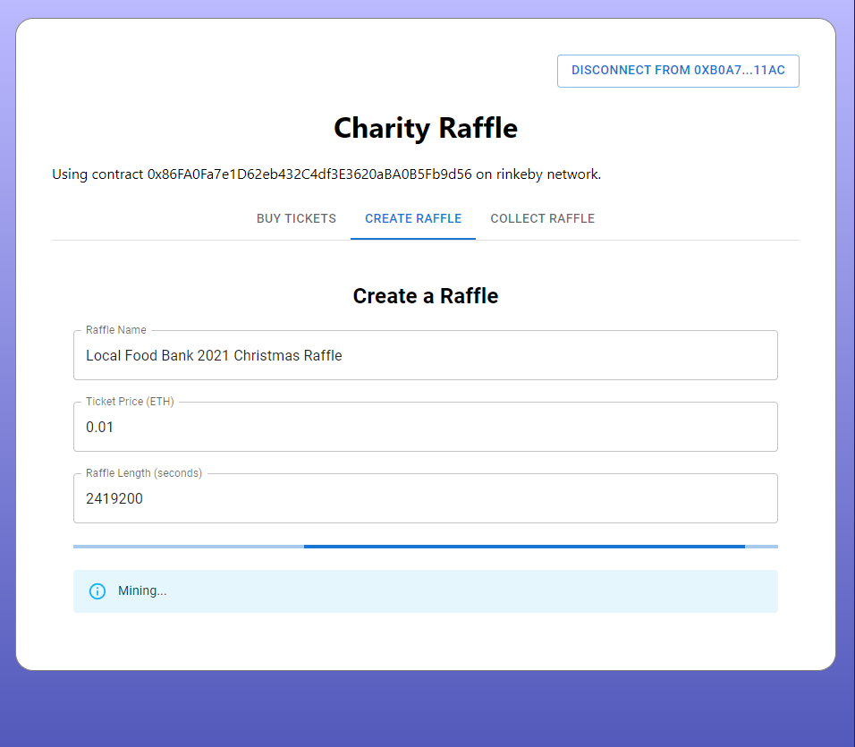
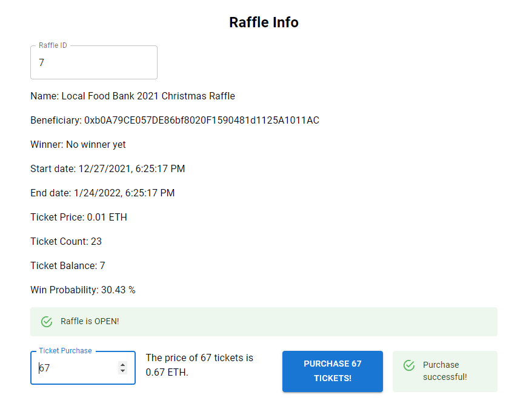
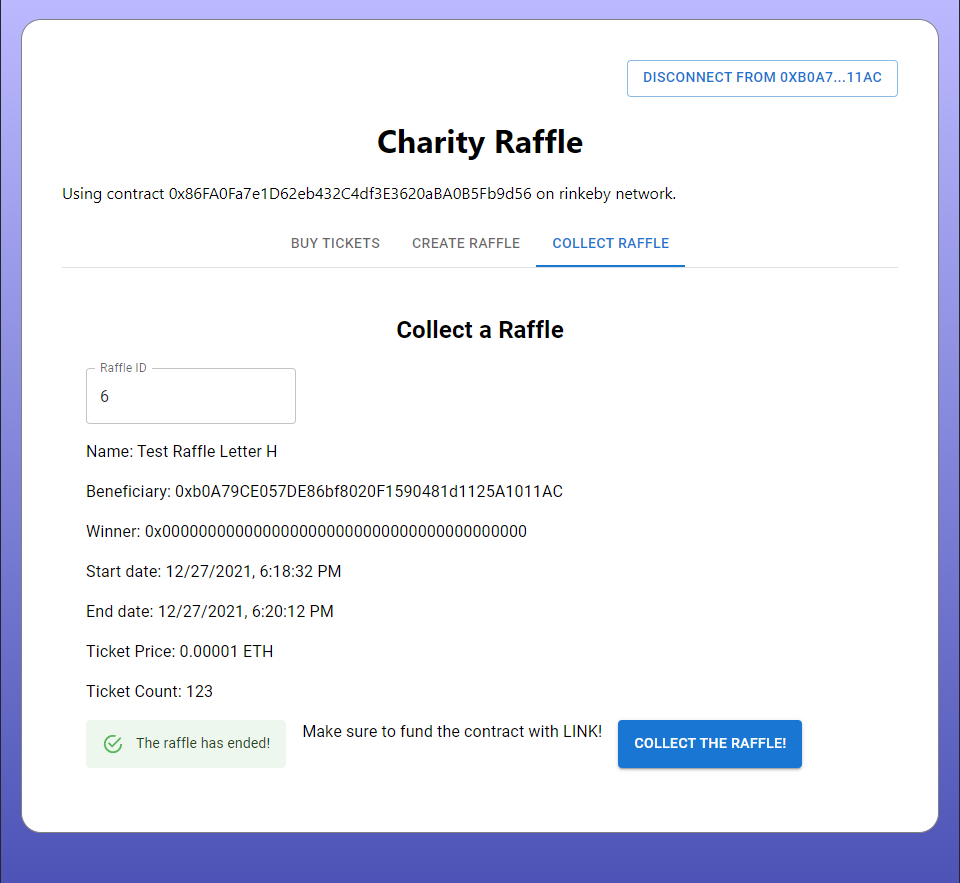

# Charity Raffle Front-End
This is a front-end for the Charity Raffle smart contract. https://github.com/SuperZooper3/CharityRaffle
Live version at: https://eth-charity-raffle.herokuapp.com/. This is automaticaly updated at each push.

## Features
### Create Raffles
Use an intuitive UI to create raffles for any reason.

### Join Raffles
An interface to get information about and buy tickets for any raffles.

### Claim Raffles
Once raffles are finished, the charity can claim the proceeds and designate a winner!

## Development Info
Made with TypeScript and React.
Libraries used:
- [Material UI](https://mui.com/) for pretty UI elements
- [UseDapp](https://usedapp.io/) to interact with Web3 providers like Metamask
- [Ethers](https://github.com/ethers-io/ethers.js/) for Ethereum blockchain utils

### Running the Web App
To run the app, you'll need to install all the dependencies in the package.json file.
Then use `yarn start` to start the app.

### Possible Improvements
- Add options for running on differnt contracts
- Test the app on a different networks
- Add more pictures
- Check for efficiency

### Caution
This app has been tested on the Rinkeby Test Network with Chrome. I cannot guarantee that it will work on other networks or browsers.
This is also my first project using TypeScript, so there is definitely some inefficiencies, breaking of conventions, etc. But it works!
